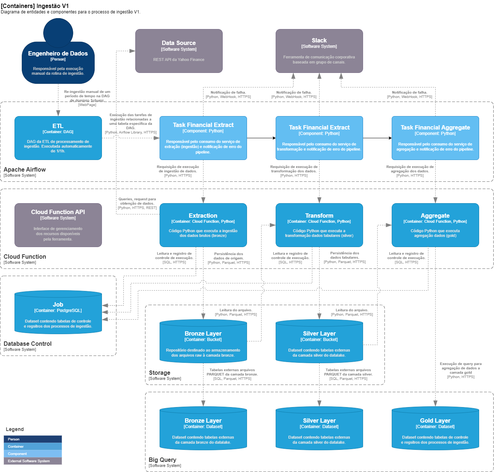

# Documentação do Caso de Estudo

## Arquitetura

Diagrama C4 Model para System Contexto da arquitetura do case:


A base da arquitetura de ingestão apresentada é utilizar o Airflow para gestão de execução de requisições para funções Cloud Functions como meio de propagação das transformações dos dados entre camadas.

Diagrama de container:



## Modelo de Datalake

Conforme requisito do case será utilizado o modelo Medallion em 3 camadas. Na arquitetura as cloud functions serão responsáveis pelo processamento adequado a cada camada, como exposto aseguir:

### Função de Extração (Bronze):

Desenvolver processo que extrai dados da API `financial_extract` hospedada partir de uma Cloud Function. Na configuração da Cloud Function configurar recebimento de requisições (gatilho) por HTTP. Salvar os dados brutos em um bucket específico de armazenamento na camada Bronze do Cloud Storage. 

### Função de Processamento (Silver):

Desenvolver função que lê dados do bucket da camada Bronze a partir de requisições HTTP, após a finalização com sucesso da extração para camada bronze. Transformar dados para formato tabular. Realizar limpeza e validação dos dados. Salvar os dados processados em um bucket de armazenamento na camada Silver do Cloud Storage.

### Função de Agregação (Gold):

Desenvolver função que consulta dados da camada Silver no BigQuery a partir de requisições HTTP, após a finalização com sucesso da transformação na camada silver. Há possibilidade de consulta direta aos arquivos do storage, mas dependerá dos modelos estabelecidos na camada Gold. Realizar agregações e criar colunas derivadas. Salvar os resultados no BigQuery estabelecendo uma camada Gold de dados.


## Estrutura do Repositório

```
financial_extract/
├── airflow             # diretório com a DAG
├── financial_extract   # diretório com código do serviço de extração
├── financial_transform # diretório com código do serviço de transformação
├── gcloud              # diretório com comandos de deploy
├── sql                 # diretório com códigos SQL Postgres e Bigquery
├── pipeline_v1_c4_diagram_system_context_png  # diagrama arquitetura
└── README.md           # Documento atual
```

## Airflow

Utilizando um cluster gerenciado do Airflow a partir do GCP Composer. Seu uso será restrito ao controle de execução da extração dos dados de cotações de papéis no mercado financeiro, obtido a partir do serviço `financial_extract` alocado em uma Cloud Function.

A DAG de controle de execução está disponível em `airflow\dag_financial_extract.py`. Executada periodicamente a cada 1 hora. Havera 2 retentativas em caso de erros no processo de extração com intevalo de 2 minutos. Esgotada as tentativas de extração uma mensagem será enviada para um canal do Slack.

### Configuração de Credenciais

Uma credencial para acesso aos recursos do GCP deve ser disponível no diretório `/home/airflow/gcs/data/gcp_conn.json` mapeada no GCP Storage confirme a instância do GCP Composer. Essa credencial deve permitir acesso à execução de Cloud Functions e recursos do GCP Storage.

Recomenda-se criar um usuário próprio e uma regra (role) dedicada para consumo dos recursos, apenas com as permissões pontuais de acesso.

### Configuração de Variáveis

Necessária as seguintes configurações de variáveis no ambiente Airflow:

- SLACK_ETL_ALERT_CHANNEL - nome do canal utilizado para difusão das mensagens
- SLACK_ETL_ALERT_USERNAME - Identificado do usuário utilizado na difusão das mensagens
- CLOUD_FUNCTION_ENDPOINT - Identificador da Cloud Function que hospeda o serviço de extração

Essas informações são obtidas a partir da configuração de um hook no Slack.

### Configuração de Conexões

Necessária as seguintes configurações de conexões no ambiente Airflow:

- SLACK_WEBHOOK_CONN_ID - host e porta do hook de difusão das mensagens para o Slack
- CLOUD_FUNCTION_CONNECTION_ID - host e porta do endereço de requisição das Cloud Functions no GCP

### DAG e Tasks

A DAG localizada em `./airflow/dag_financial_data.py` contém 3 (trÊs) tasks que realizadm a chamada sequencial dos serviços correspondentes à "extração", "transformação" e "agregação" no pipeline de ingestão.

A primeira task, "financial_extract", cria um identificador UUID que deverá ser utilizado por todas tasks nas chamadas aos serviços Cloud Functions. Esse identificador permitira rastreabilidade do pipeline na base de dados de registros de execução (PostgreSQL) e quaisquer posteriores iniciativas de controle de idempotência.

A passagem de parâmetros entre as tasks é realizada através de XCOM, com o JSON de retorno das chamadas. Um pequeno tratamento foi codificado para avaliar o retorno das requisições, mas cabe uma análise com maior rigor visando consolidar tratamento em exceptions.


## Cloud Functions

Recomenda-se utilizar funções de segunda geração em função da disponibilidade de tempo ativo de uma execução em requisições HTTP (cerca de 1 hora na 2nd version comparada a 9 minutos com a 1rs version).

O deploy dos serviços como CLoud Functions serão realizadados a partir do armazenamento de um arquivos compactado ZIP em um bucket do Cloud Storage. O processo de criação desse arquivo já está automatizado no arquivo Makefile disponível no diretório dos serviços.

### Credenciais

Recomenda-se criar um usuário próprio e uma regra (role) dedicada para consumo dos recursos, apenas com as permissões pontuais de acesso.

### Heartbeat

Em todos serviços elaborados há a presença de uma thread responsável pela atualização do status do job enquanto em processo de execução.  

```python
def _heartbeat(ctx: Context, conn, mutex: threading.Lock):
    log.info(f"Heartbeat for {ctx.execution.execution_id} initiated")

    tms = datetime.now()

    while True:
        # aguarda por um pequeno intervalo, para evitar 
        # que a conclusão da execução seja afetada pelo
        # tempo do heartbeat
        #
        time.sleep(HEARTBEAT_SLEEPING)

        # verificar se já é hora de atualizar  o status 
        # da execução
        #
        if tms + HEARTBEAT_INTERVAL < datetime.now():
            try:
                # tenho que ter exclusividade no controlador
                # de contexto para garantir que ninguém esteja
                # manipulando o status
                #
                mutex.acquire()

                if ctx.execution.status == EXECUTION_STATUS_RUNNING:    <<<=====
...
```

Trata-se de um controle de sincronização que atua na variável `status` do context de execução. O controle envolde as funções `_heaertbeat` e a função de atualização de status `_update_execution_status`. Dessa forma, temos recursos para no gerenciamento do pipeline criar mecanismo de identificação de registros `zombie` no controle de ingestão.


### Serviço de Extração ou Ingestão (BRONZE)

Esse serviço é desenvolvido na linguagem Python e disponibilizado no diretório `financial_extract`. Os procedimentos de instalação e uso estão disponíveis no arquivo [Documentação do Serviço Financial Extract](./financial_extract/README.md).

Para realizar o deploy, abordado no documento específico já citado, podemos utilizar os comandos disponíveis no arquivo `./gcloud/cf_financial_extract.cmd`.

```bash
# Autenticação
gcloud auth login

# Configurar o projeto
gcloud config set project <PROJET_ID>

# Deploy da Cloud Function
gcloud functions deploy cf_financial_extract \
  --region=us-east4 \
  --runtime=python310 \
  --source=gs://<source-bucket>/cf_financial_extract_v1.0 \
  --entry-point=main \
  --trigger-http \
  --allow-unauthenticated \
  --memory=256MB
```

> TODO: Tratamento de idempotência na Cloud Function para controlar apenas um processamento por mensagem.

### Serviços de Transformação (SILVER)

Esse serviço é desenvolvido na linguagem Python e disponibilizado no diretório `financial_transform`. Os procedimentos de instalação e uso estão disponíveis no arquivo [Documentação do Serviço Financial Transform](./financial_transform/README.md) e são muito semelhantes ao serviço anterior.

Para realizar o deploy, abordado no documento específico já citado, podemos utilizar os comandos disponíveis no arquivo `./gcloud/cf_financial_transform.cmd`, semelhantemente ao demonstrado anteriormente.

#### Boundaries Ingestion

Por questão de tempo não foi possivel codificar procedimento de limpeza de registros de borda de ingestão, porém, foi anotado no código a demanda. Issofaz-se necessario em decorrência dos *delays* na consolidação das bases de origem. Esses *delays* podem ocorre por diversos motivos e não há garantia que o último dado obtido da ingestão tenha a maior data dos registros que ainda estão por ser inseridos ou atualizados (filas, thread e isolation level). Portanto, é necessário voltar um pouco na estampa de tempo da execução utilizada na query anterior, visando obter esses dados possivelmente ausentes.

Por causa desse procedimento a camada Silver tem que realizar o tratamento de duplicidades na consolidação de sua tabela. Removendo os itens duplicados do dataframe antes da criação do arquivo parquet. Temos ciência desse problema, mas infelizmente não foi possível sua implementação a contento.

> Utilizar a camada Silver como tabela nativa do Big Query facilitaria o processo de boundaries cleaning, pois construir código SQL para esse tipo de problema é muito mais simples que codificar em outros paradigmas. Caberia avaliar se o  particionamento utilizado seria adequado ao uso estabelecido.
> 
> A camada Silver como dados tabulares, representam um espelho da tabela transacional. Os colaboradores de áreas que consomem as informações transacionais são os principais requerentes de acesso a estes datasets. Analisar suas demandas e estabalecer critérios de seleção impact adiretamente nos custas e, consequentemente, na definição de partição da tabela.
>
> Utilizar tabela externa possibilita a utilização de outros *engines* de bancos de dados (DuckDB, Cassandra, etc.) visando ter maior eficiencia na gestão ds recursos.

## Database Control

Refer-se a uma instância do banco de dados PostgreSQL utilizada para armazenamento de tabela de configuração e registros de execução de jobs de extração/ingestão.

A partir de uma instância Cloud SQL para a versão PostgreSQL 12, criaremos um schema e tabelas visando configurar e controlar os jobs de execução do pipeline.

As tabelas PostgreSQL utilizadas são:

### Tabela: ingestion_job_config
| Coluna | Tipo | Descrição |
|--------|------|-----------|
| job_name | VARCHAR(64) | Nome único do job (Chave Primária) |
| tickers | VARCHAR(1000) | Lista de símbolos dos ativos a serem extraídos |
| interval | INTEGER | Intervalo entre extrações |
| overlap | INTEGER | Sobreposição permitida entre extrações |
| bucket_name | VARCHAR(128) | Nome do bucket no GCP Storage |
| updated_by | VARCHAR(64) | Usuário que atualizou a configuração |
| created_at | TIMESTAMP | Data de criação do registro |
| updated_at | TIMESTAMP | Data da última atualização |

### Tabela: ingestion_job_execution
| Coluna | Tipo | Descrição |
|--------|------|-----------|
| id | SERIAL | ID sequencial (Chave Primária) |
| execution_id | VARCHAR(64) | ID único de execução vindo do Airflow |
| job_name | VARCHAR(64) | Nome do job executado |
| tickers | VARCHAR(1000) | Lista de símbolos processados |
| interval | INTEGER | Intervalo utilizado |
| overlap | INTEGER | Sobreposição utilizada |
| bucket_name | VARCHAR(128) | Bucket onde os dados foram armazenados |
| start_time | TIMESTAMP | Timestamp do início dos dados extraídos |
| end_time | TIMESTAMP | Timestamp do final dos dados extraídos |
| filename | VARCHAR(128) | Nome do arquivo gerado |
| records | INTEGER | Número de registros processados |
| status | VARCHAR(64) | Status da execução (ex: SUCCESS, FAILED) |
| created_at | TIMESTAMP | Data de criação do registro |
| updated_at | TIMESTAMP | Data da última atualização |

> NOTA: A coluna `tickers` deveria ser caracterizada por um registro generalizado, pois deve referir-se a uma informação extra para todos jobs do pipeline. Por motivos de tempo foi deixado específico.

Os comandos SQL para criação das tabelas são apresentados em:
- `./sql/pg_ingestion_job_config.sql`
- `./sql/pg_ingestion_job_execution.sql`

Por motivo de tempo não serão apresentados os comando para criação dos recursos de banco como DATABASE, SCHEMA, e DESCRIPTIONS.


## Cloud Storage

Os bucket para camadas bronze e silver podem ser configuradas em regime default, sem necessidade de notificações para o Pub/Sub. Cada bucket deve ser independente, pois fornecerá maior flexibilidade de tratamento a erros para cada camada em particular. Por exemplo:

- Camada Bronze: gs://bronze_layer/[domain]
- Camada Silver: gs://silver_layer/[domain]

> TODO: adicionar comando para criação de buckets.

A camada Gold não conterá arquivos no Cloud Storage. Deverá ser um conjunto de  datasets nativo do Big Query.


## Big Query

### Camadas Bronze e Silver

As tabelas para a camada Bronze e Silver serão do tipo externas, geradas a partir do arquivos no formato parquet localizadas nos bucket correspondentes.

Para realizar a criação das tabelas podemos utilizar as queries disponíveis nos arquivos `./sql/bq_*.sql`

Como exemplo, abaixo os script para criação da camada bronze:

```sql
CREATE EXTERNAL TABLE projetct_id.bronze_layer.financial_extact
(
    date 		TIMESTAMP OPTIONS(description = 'Data da cotação'),
    ticker 		STRING  OPTIONS(description = 'Símbolo da ação'),
    open 		INTEGER OPTIONS(description = 'Preço de abertura'),
    adj_close 	INTEGER OPTIONS(description = 'Preço de fechamento ajustado'),
    close       INTEGER OPTIONS(description = 'Preço de fechamento'),
    high 		INTEGER OPTIONS(description = 'Preço mais alto do dia'),
    low 		INTEGER OPTIONS(description = 'Preço mais baixo do dia'),
    volume 		INTEGER OPTIONS(description = 'Volume de negociações')
)
OPTIONS 
(
	uris = ['gs://{bucket_name}/*.parquet']
	format = 'PARQUET',
	hive_partition_uri_prefix = 'gs://[bucket_name]',
	require_hive_partition_filter = false
);
```

Nas camadas Bronze e Silver utilizaremos particionamento Hive, com a utilização de subdiretórios que servem cmo coluna de filtro e seleção de registros.

> Há possibilidade de utilizar a camada Silver como dados tabulares nativos, devendo nessa implementação fazer uso de partições e clusterização conforma a necessidade de cada dataset. Optamos pela estratégia mais simples e barata visando posterior refatoração em face de maior amplitudo de uso.

### Camada Gold

Utilizaremos uma tabela para a camda Gold que agrega os dados recebidos. O arquivo com o script está disponível em `./sql/bq_gold_financial_extract.sql`, também observado a seguir:

```sql
CREATE TABLE projetct_id.gold_layer.financial_data_hour
(
    ticker 		STRING  OPTIONS(description = 'Símbolo da ação'),
    date 		TIMESTAMP OPTIONS(description = 'Data da cotação'),
    volume 		INTEGER OPTIONS(description = 'Volume de negociações')
    execution_id STRING OPTIONS(description = 'Identificador de execução do job de ingestão'),
)
PARTITIONS 
(
    DATE(date)
)
CLUSTER BY
    ticker,
    execution_id
;
```

Visando diminuir o custo de operações de merge, consolidação temporal, adotamos particionamento pela data, e somente a data, da coluna "date" do ticker (lembrando que o BigQuery permite até 4000 partições por tabela). Aproveitamos para clusterizar a coluna "ticker" e, conjuntamente, a coluna "execution_id".

Atualmente há a possibilidade de utilizar indexadores no BigQuery, mas por se tratar de um case simples, esse recurso não foi considerado aqui. Da mesma forma a utilização de procedures ou functions permite diminuir o acoplamento dos serviços ao modelo de dados.

